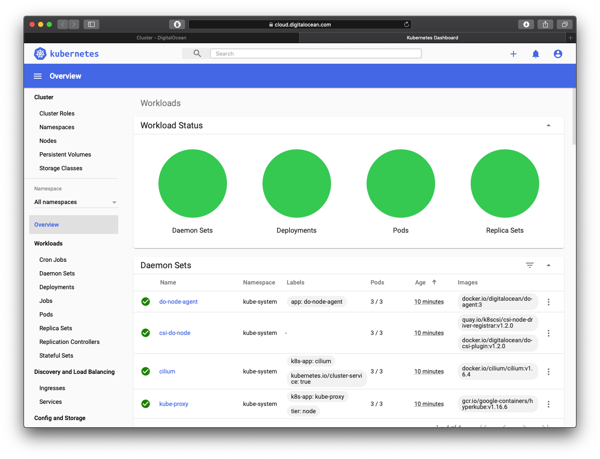
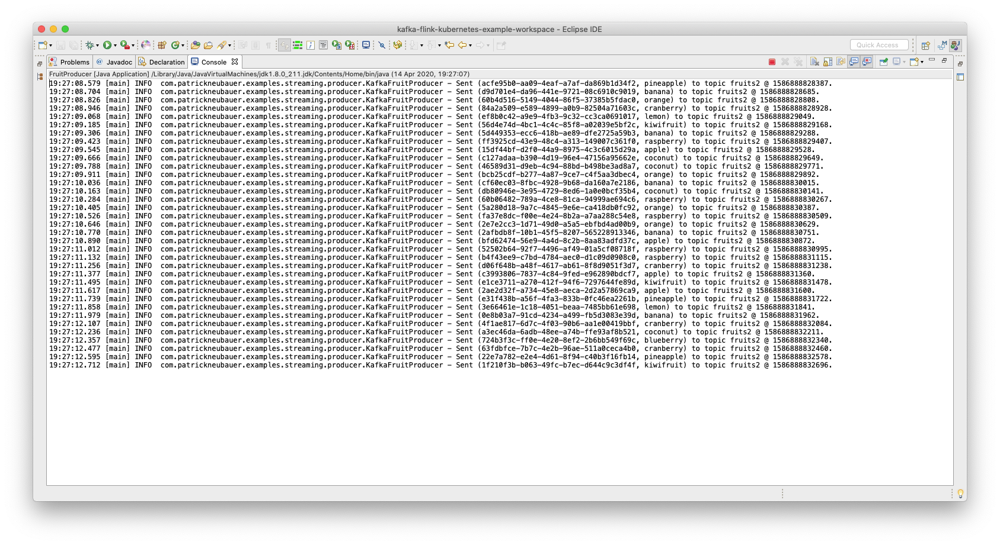
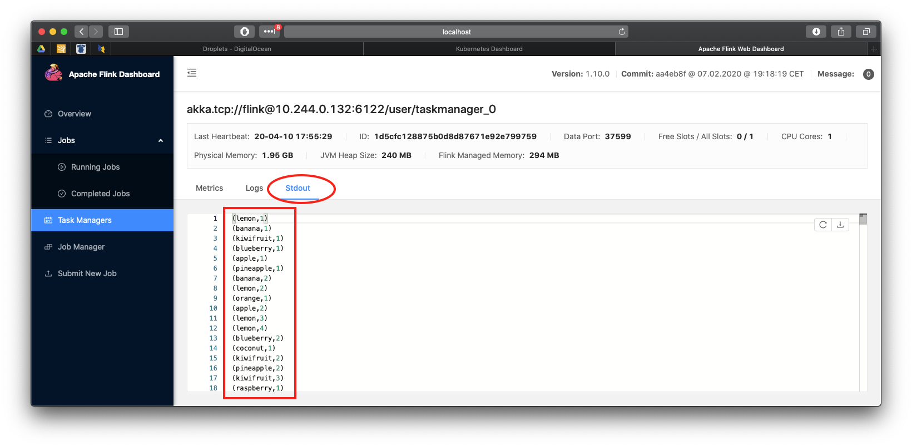

kafka-flink-kubernetes-example
---

Example showcasing the use of an [Apache Kafka](https://kafka.apache.org) topic by an [Apache Flink](https://flink.apache.org) job (stream consumer) based on [Strimzi](https://strimzi.io) and [Kubernetes](https://kubernetes.io).

- Producer sending random names of fruits to Kafka topic
- Consumer using Kafka to output received messages
- Streaming Consumer using Flink to count the occurrences of fruit names

Requirements
---
- Kubernetes kubectl binaries (see [installation instructions](https://kubernetes.io/docs/tasks/tools/install-kubectl/))
- Apache Flink binaries (install using ``brew install apache-flink`` on mac or by download and unpacking [Flink binaries](https://archive.apache.org/dist/flink/flink-1.10.0/))
- Running Kubernetes minikube or distributed cluster


Infrastructure provisioning (remote Kubernetes cluster, tested)
---

Example based on [Digitalocean Kubernetes](https://cloud.digitalocean.com/kubernetes/). 

Provision new Kubernetes cluster and download configuation file (i.e. used to access the cluster remotely) as indicated in the following screenshots:


Access Kubernetes dashboard to inspect and manage resources (pods, services, etc.):





Destroy running Kubernetes cluster:


Kafka deployment
---

*First, make sure to follow infrastructure provisioning steps described above. If a remote Kubernetes cluster has been created, make sure to add the argument ``--kubeconfig="/path/to/downloaded/fruits-cluster-kubeconfig.yaml`` to every ``kubectl`` command. Further, execute all commands listed below within the root directory of this repository.*


1. Create namespace for Kafka
    
        kubectl create namespace kafka
    

1. Prepare installation files to reference namespace
On Linux (untested):
    
        sed -i 's/namespace: .*/namespace: kafka/' kafka/strimzi-0.17.0/install/cluster-operator/*RoleBinding*.yaml
    
On Mac (tested):
    
        sed -i '' 's/namespace: .*/namespace: kafka/' kafka/strimzi-0.17.0/install/cluster-operator/*RoleBinding*.yaml
    

1. Create namespace for example application (assuming environment variable ``STRIMZI_NAMESPACE`` in file ``kafka/strimzi-0.17.0/install/cluster-operator/050-Deployment-strimzi-cluster-operator.yaml`` is set to value ``fruits`` and ``valueFrom`` incl. children deleted)
    
        kubectl create namespace fruits
    

1. Deploy custom resource definitions (CRDs) and role-based access control (RBAC) resources to manage the CRDs
    
        kubectl apply -f kafka/strimzi-0.17.0/install/cluster-operator/ -n kafka


1. Give permission to the Cluster Operator to watch the fruits namespace
    
        kubectl apply -f kafka/strimzi-0.17.0/install/cluster-operator/020-RoleBinding-strimzi-cluster-operator.yaml -n fruits

        kubectl apply -f kafka/strimzi-0.17.0/install/cluster-operator/032-RoleBinding-strimzi-cluster-operator-topic-operator-delegation.yaml -n fruits

        kubectl apply -f kafka/strimzi-0.17.0/install/cluster-operator/031-RoleBinding-strimzi-cluster-operator-entity-operator-delegation.yaml -n fruits


1. Create Kafka cluster with one Zookeeper and one Kafka broker as follows
    
```
cat << EOF | kubectl create -n fruits -f -
apiVersion: kafka.strimzi.io/v1beta1
kind: Kafka
metadata:
  name: fruits-cluster
spec:
  kafka:
    replicas: 1
    listeners:
      plain: {}
      tls: {}
      external:
        type: nodeport
        tls: false
    storage:
      type: jbod
      volumes:
      - id: 0
        type: persistent-claim
        size: 100Gi
        deleteClaim: false
    config:
      offsets.topic.replication.factor: 1
      transaction.state.log.replication.factor: 1
      transaction.state.log.min.isr: 1
      auto.create.topics.enable: true
  zookeeper:
    replicas: 1
    storage:
      type: persistent-claim
      size: 100Gi
      deleteClaim: false
  entityOperator:
    topicOperator: {}
    userOperator: {}
EOF
```


1. Wait for cluster deployment to complete (command execution will terminate when deployment is completed)
    
        kubectl wait kafka/fruits-cluster --for=condition=Ready --timeout=300s -n fruits
    
Expected output (once deployment completes):

        kafka.kafka.strimzi.io/fruits-cluster condition met


1. After cluster deployment has completed successfully, create Kafka topic
    
```
cat << EOF | kubectl create -n fruits -f -
apiVersion: kafka.strimzi.io/v1beta1
kind: KafkaTopic
metadata:
  name: fruits-topic
  labels:
    strimzi.io/cluster: "fruits-cluster"
spec:
  partitions: 3
  replicas: 1
EOF
```
    
Sources:
 - [Strimzi.io Quickstart](https://strimzi.io/docs/quickstart/latest/)


Flink deployment
---

*First, make sure to follow infrastructure provisioning steps described above. If a remote Kubernetes cluster has been created, make sure to add the argument ``--kubeconfig="/path/to/downloaded/fruits-cluster-kubeconfig.yaml`` to every ``kubectl`` command. Further, execute all commands listed below within the root directory of this repository.*

1. Apply YAML files to running Kubernetes cluster
    
        kubectl -n fruits apply -f flink/flink-configuration-configmap.yaml
    
        kubectl -n fruits apply -f flink/jobmanager-service.yaml
    
        kubectl -n fruits apply -f flink/jobmanager-deployment.yaml
        
        kubectl -n fruits apply -f flink/taskmanager-deployment.yaml
            

1. Setup Flink port-forwarding: see section 'Setup Flink port-forwarding (...)' below.


Deploying both Kafka and Flink as descibed above results in the following list of Kubernetes pods in namespace ``fruits`` and a pod named ``strimzi-cluster-operator-...`` in namespace ``kafka``:


Prepare sources for execution
---

1. Determine bootstrap service port number and ajust ``Settings.java`` accordingly
    
        kubectl get service fruits-cluster-kafka-external-bootstrap -n fruits -o=jsonpath='{.spec.ports[0].nodePort}{"\n"}'
    

1. Determine Kubernetes cluster node external IP address as indicated in below screenshots and adjust ``Settings.java`` accordingly


1. Prepare ``pom.xml`` (optional) and generate Flink JAR 

Make sure the Java class that is intended to be launched is indicated in ``pom.xml`` as ``transformer`` in ``transformers`` of ``maven-shade-plugin`` artifact and specified as ``configuration`` in ``execution`` for ``package`` phase with ``shade`` goal:


<transformer implementation="org.apache.maven.plugins.shade.resource.ManifestResourceTransformer">
    <mainClass>com.patrickneubauer.examples.kafkaflinkkubernetes.consumer.FlinkFruitConsumer</mainClass>
</transformer>
 

1. Generate JAR by either issuing ``mvn clean install`` command from console or right-click on imported Eclipse project selecting ``Run As > Maven Install`` (i.e. generating JAR files in ``target`` folder)


Setup Flink port-forwarding (required) and proxy (for optional Flink web UI accessability)   
---

1. Determine Kubernetes pod name of Flink jobmanager
    
        kubectl -n fruits get pods
    

1. Setup port forwarding from localhost to Kubernetes pod that runs Flink jobmanager (keep console open to maintain port forwarding)
    
        kubectl -n fruits port-forward FLINK_JOB_MANAGER_POD_NAME 8081:8081
    

1. Optional: setup proxy for Flink web UI that redirects to Kubernetes Flink web server (keep console open to maintain proxy)
    
        kubectl -n fruits proxy
    
If proxy is enabled and chosen namespace is ``fruits``, the Flink web UI may be accessed by pointing a web browser to [http://localhost:8001/api/v1/namespaces/fruits/services/flink-jobmanager:ui/proxy/#/overview](http://localhost:8001/api/v1/namespaces/fruits/services/flink-jobmanager:ui/proxy/#/overview). 


Execute example
---
*First, make sure infrastructure is provisioned, Kafka and Flink are deployed, sources are prepared for execution, and ports forwarded from localhost to Kubernetes cluster.*

1. Launch Kafka producer ``FruitProducer.java`` (Java class with main method)

Expected output:




1. Option A (does not work (yet)): Run Flink consumer ``FruitConsumer.java`` (Java class with main method)

1. Option B (works): Run Flink consumer by uploading JAR from command line

        flink run -m localhost:8081 target/kafka-flink-example-0.0.1-SNAPSHOT-jar-with-dependencies.jar

Expected output:


1. Optional: inspect job execution status in Flink web UI (requires proxy setup as indicated in section 'Setup Flink port-forwarding (...)') located at [http://localhost:8001/api/v1/namespaces/fruits/services/flink-jobmanager:ui/proxy/#/overview](http://localhost:8001/api/v1/namespaces/fruits/services/flink-jobmanager:ui/proxy/#/overview) (assuming chosen namespace is ``fruits``)

Expected output:




Video (<2 min):

[https://drive.google.com/file/d/1NJuPFrJVrejuJZdKzNCSULedELQ1gX_k/view](https://drive.google.com/file/d/1NJuPFrJVrejuJZdKzNCSULedELQ1gX_k/view)


Useful commands (optional)
---

Run a Kafka command-line producer (replace ``CLUSTER-NODE-EXTERNAL-ADDRESS`` and ``BOOTSTRAP-SERVICE-PORT`` accordingly as indicated in section 'Prepare sources for exection'):
    
    cd /usr/local/Cellar/kafka/2.4.1/bin
    ./kafka-console-producer --broker-list CLUSTER-NODE-EXTERNAL-ADDRESS:BOOTSTRAP-SERVICE-PORT --topic fruits-topic


Run a Kafka command-line consumer (replace ``CLUSTER-NODE-EXTERNAL-ADDRESS`` and ``BOOTSTRAP-SERVICE-PORT`` accordingly as indicated in section 'Prepare sources for exection'):
    
    cd /usr/local/Cellar/kafka/2.4.1/bin
    ./kafka-console-consumer --bootstrap-server CLUSTER-NODE-EXTERNAL-ADDRESS:BOOTSTRAP-SERVICE-PORT --topic fruits-topic --from-beginning


Create Kafka topic from command-line (replace ``CLUSTER-NODE-EXTERNAL-ADDRESS`` and ``BOOTSTRAP-SERVICE-PORT`` accordingly as indicated in section 'Prepare sources for exection'):
    
    cd /usr/local/Cellar/kafka/2.4.1/bin
    ./kafka-topics --create --bootstrap-server CLUSTER-NODE-EXTERNAL-ADDRESS:BOOTSTRAP-SERVICE-PORT --replication-factor 1 --partitions 1 --topic my-new-topic


List existing Kafka topics in command-line (replace ``CLUSTER-NODE-EXTERNAL-ADDRESS`` and ``BOOTSTRAP-SERVICE-PORT`` accordingly as indicated in section 'Prepare sources for exection'):
    
    cd /usr/local/Cellar/kafka/2.4.1/bin
    ./kafka-topics --list --bootstrap-server CLUSTER-NODE-EXTERNAL-ADDRESS:BOOTSTRAP-SERVICE-PORT


Execute Flink job by uploading from command-line. This requires Flink binaries to be available and Flink port-forward to be setup as indicated in section 'Setup Flink port-forwarding (...)')

    flink run -m localhost:8081 /usr/local/Cellar/apache-flink/1.10.0/libexec/examples/streaming/WordCount.jar


Infrastructure provisioning (local [Kubernetes minikube](https://kubernetes.io/docs/setup/learning-environment/minikube/) cluster, untested)
---

Provision new Kubernetes minikube on localhost:

    minikube start

Deploy and access Kubernetes dashboard on localhost (see [documentation](https://kubernetes.io/docs/tasks/access-application-cluster/web-ui-dashboard/) for more details) to inspect and manage resources (pods, services, etc.):

    kubectl apply -f https://raw.githubusercontent.com/kubernetes/dashboard/v2.0.0-beta8/aio/deploy/recommended.yaml

    kubectl proxy

Destroy running Kubernetes minikube:

    minikube delete


Create Kubernetes load balancer and expose external IP address (optional)
---

See source below (untested).

Source:
 - [https://kubernetes.io/docs/tutorials/stateless-application/](https://kubernetes.io/docs/tutorials/stateless-application/)

